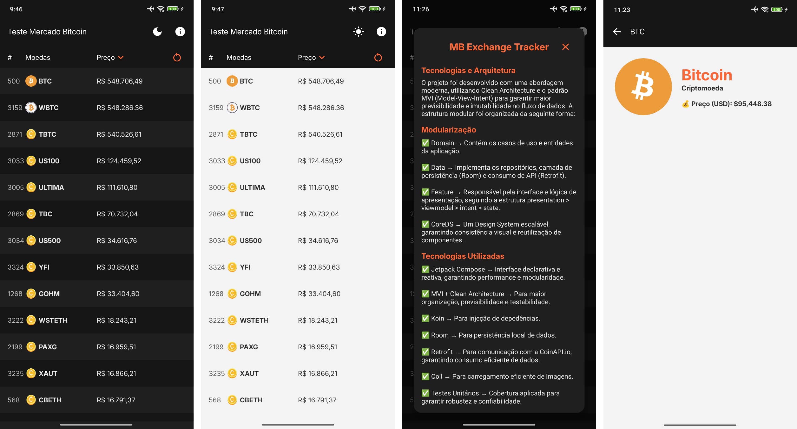

# Teste Mercado Bitcoin

## Descrição
Este aplicativo permite listar as exchanges de criptomoedas disponíveis na [CoinApi.io](https://docs.coinapi.io/exchange-rates-api). Conforme solicitado [AQUI](https://github.com/mercadobitcoin/querosermb).

## Features
- **Tela de listagem:**
    - Exibir, pelo menos, os campos: name, exchange_id e volume_1day_usd
      Ao tocar em um item deve ser exibida a tela de detalhes.
- **Tela de detalhe:**
    - Exibir os detalhes da exchange.

## Tecnologias e Arquitetura
Este projeto utiliza as seguintes tecnologias e práticas:

- **Retrofit**: Biblioteca para requisições HTTP na API [CoinApi.io](https://docs.coinapi.io/exchange-rates-api).
- **Jetpack Compose**: Framework de UI para construir a interface de usuário de forma declarativa.
- **Koin**: Framework de injeção de dependência para gerenciar os componentes do aplicativo.
- **Arquitetura MVI (Model-View-Intent)**: Padrão arquitetural utilizado para separar claramente as responsabilidades no código.
- **Clean Architecture**: Estrutura do código organizada em camadas, promovendo a separação de preocupações e facilitando a manutenção.
- **Room**: Biblioteca de persistência para gerenciamento local de dados, utilizado para armazenar as moedas no banco de dados (já que a API_KEY gratuita tem cota).
- **Coroutines**: Biblioteca para programação assíncrona e concorrente.
- **Desing System**: Criado um design system para padronizar as cores e componentes do app, com suporte a dark mode.

Para instalar uma versão [CLIQUE AQUI](https://drive.google.com/file/d/1fZbrR43ykO9i9tf6JMB-9dP28_O9qn8P/view?usp=sharing)

Aqui estão algumas capturas de tela do aplicativo:

Obrigado por conferir este projeto! 🚀